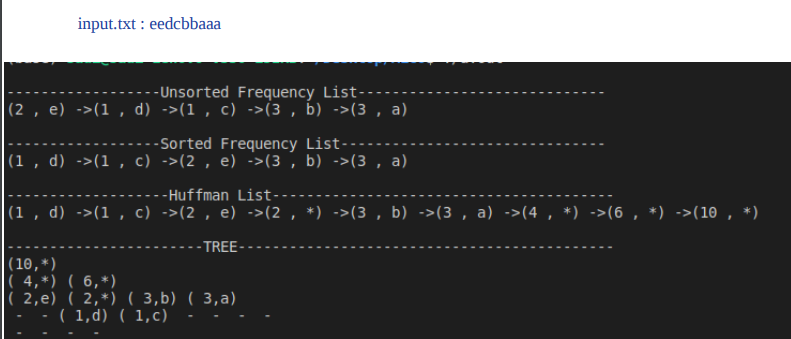
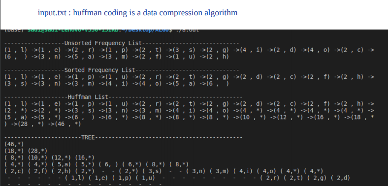

# Huffman-Coding
Huffman Coding by using Huffman Tree

## Explanation
  It reads the given text and for every character, it gives us a unique numbers. So this leads to data compression for texts.
  ### Example 1
  
  
  ### Example 2
  
